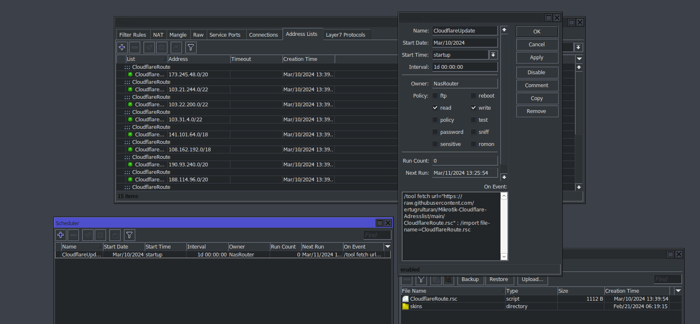

[](https://github.com/ertugrulturan/Mikrotik-Cloudflare-Adresslist/actions/workflows/main.yml)
Use (You can add it as a Scheduler),
```
/tool fetch url="https://raw.githubusercontent.com/ertugrulturan/Mikrotik-Cloudflare-Adresslist/main/CloudflareRoute.rsc" ; /import file-name=CloudflareRoute.rsc
```

